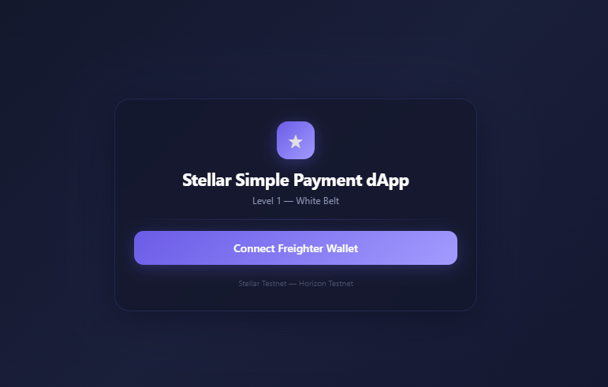
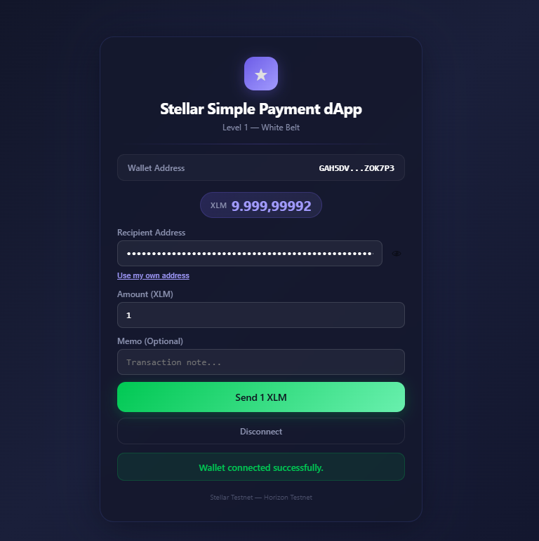
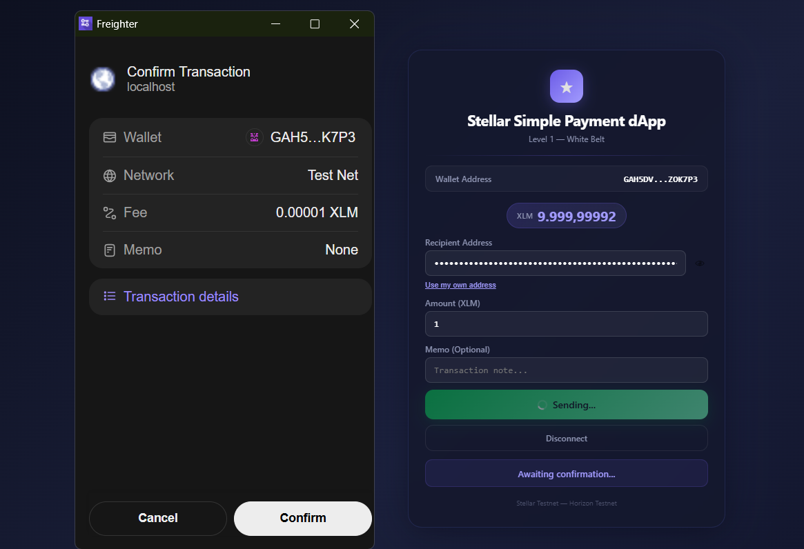
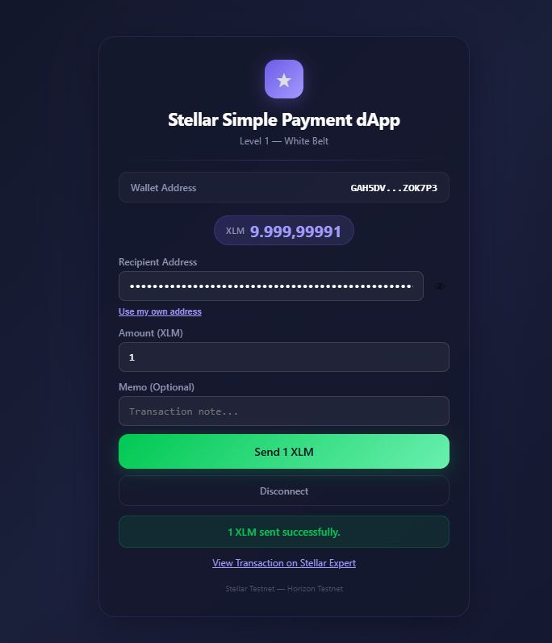

# Stellar Simple Payment dApp

A decentralized payment application built on the **Stellar Testnet** that connects to the Freighter wallet, displays XLM balance, and sends payments — all in a single-page React interface.

Built for the **Stellar Journey to Mastery — Level 1 (White Belt)** program.

---

## Features

- 🔗 **Freighter Wallet Connection** — Connect and disconnect your Stellar wallet
- 💰 **XLM Balance Display** — View your native XLM balance from Testnet
- ✉️ **Send Payments** — Send variable amounts of XLM to any Stellar address
- 📝 **Memo Support** — Add an optional transaction memo
- 👁 **Address Toggle** — Hide/show recipient address with a password/text toggle
- 🔄 **Use My Own Address** — Auto-fill your own wallet address as recipient
- ✅ **Transaction Feedback** — Status messages (connecting, preparing, awaiting confirmation, success/failure)
- 🔗 **Stellar Expert Link** — Clickable link to view completed transactions on `stellar.expert`
- ❌ **Cancel Handling** — Graceful "Transaction cancelled" message when user declines in Freighter

---

## Tech Stack

- **Framework:** [Vite 8](https://vite.dev/) + [React 19](https://react.dev/)
- **Styling:** Plain CSS (`App.css`)
- **Blockchain SDK:** [`@stellar/stellar-sdk`](https://github.com/stellar/js-stellar-sdk) v16
- **Wallet API:** [`@stellar/freighter-api`](https://github.com/stellar/freighter) v6
- **Network:** Stellar Testnet (`https://horizon-testnet.stellar.org`)

---

## Prerequisites

- **Node.js** v18+
- **npm** or **yarn**
- **Freighter Wallet** browser extension installed and configured to **Testnet**

---

## Getting Started

### 1. Clone the repository

```bash
git clone https://github.com/eylulssat/stellar-payment-dapp.git
cd stellar-payment-dapp
```

### 2. Install dependencies

```bash
npm install
```

### 3. Start the development server

```bash
npm run dev
```

Open [http://localhost:5173](http://localhost:5173) in your browser.

### 4. Build for production

```bash
npm run build
```

The output is in the `dist/` folder.

---

## Usage

1. Make sure the **Freighter** extension is installed and set to **Testnet**.
2. Click **Connect Freighter Wallet**.
3. Approve the connection in Freighter.
4. Your wallet address (shortened) and XLM balance will appear.
5. Enter a recipient address, amount, and optional memo.
6. Click **Send {amount} XLM**.
7. Approve the transaction in Freighter.
8. View the result — success hash or error message.

---

## Screenshots

| Connect Wallet | Wallet Connected | Payment Form | Transaction Success |
|---|---|---|---|
|  |  |  |  |

---

## Project Structure

```
stellar-payment-dapp/
├── .gitignore
├── index.html
├── package.json
├── vite.config.js
├── README.md
├── screenshots/
│   ├── 01-connect.png
│   ├── 02-wallet.png
│   ├── 03-payment.png
│   └── 04-success.png
└── src/
    ├── main.jsx
    ├── App.jsx
    └── App.css
```

---

## License

MIT
